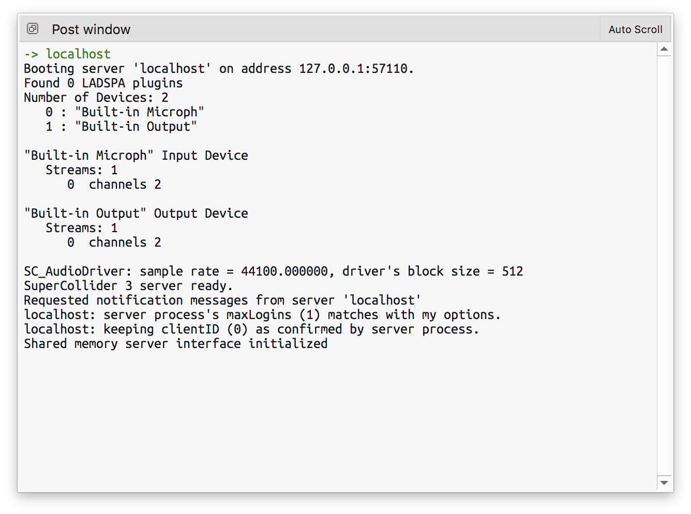
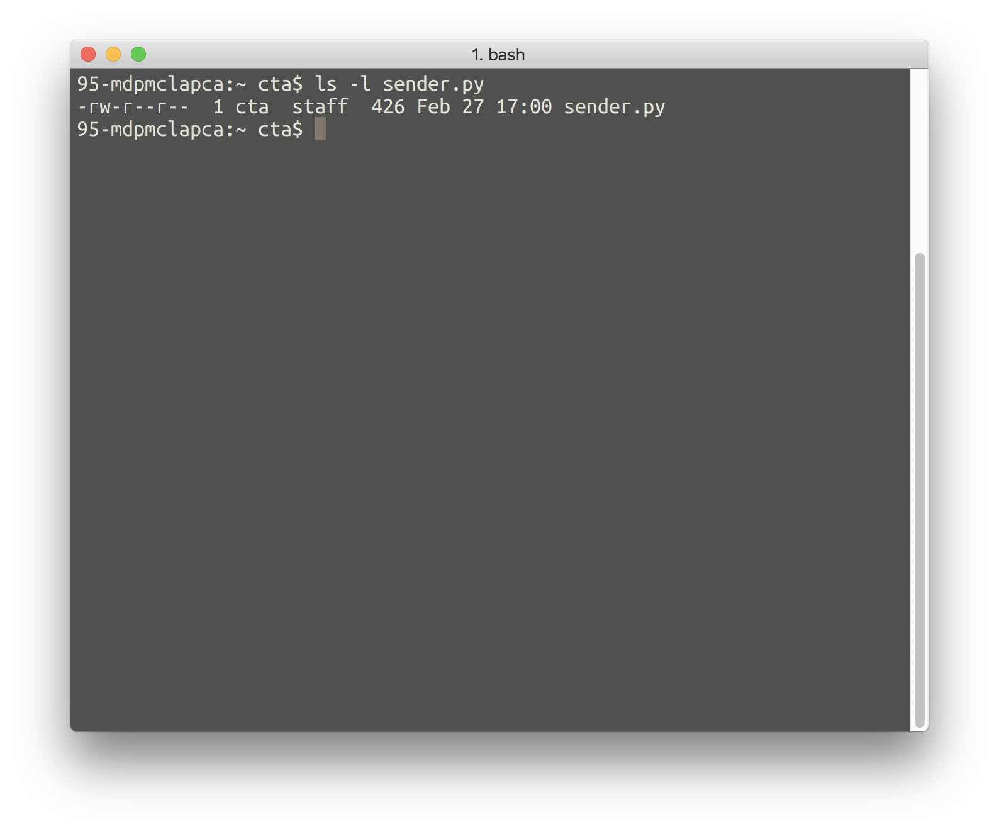
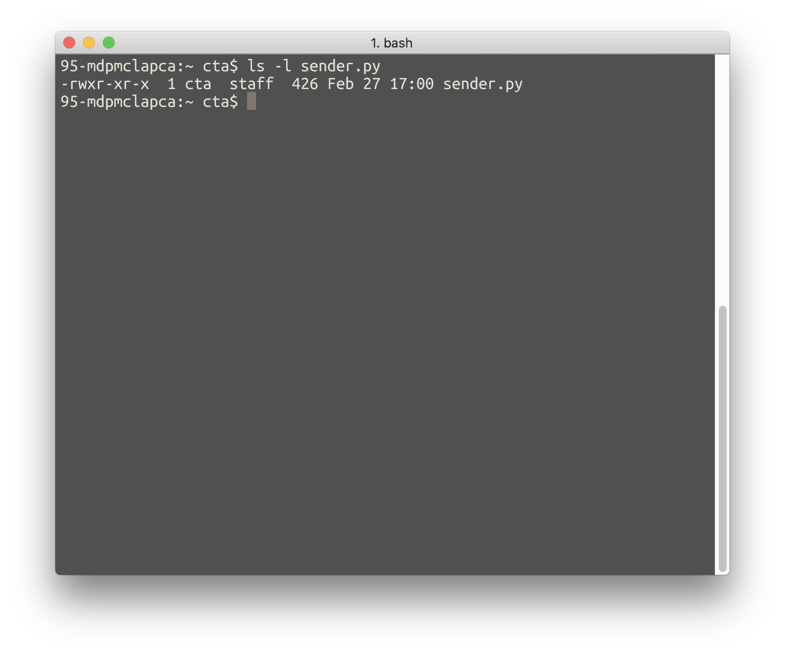
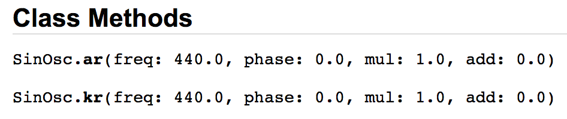

# Python to Supercollider
*Spring 2020, Casey Anderson*

### Reference

* [SuperCollider](https://supercollider.github.io/)
* [SCBook](http://supercolliderbook.net/)
* [SCMailing Lists](http://www.birmingham.ac.uk/facilities/BEAST/research/supercollider/mailinglist.aspx)
* [OpenSoundControl](http://opensoundcontrol.org/)
* [pyOSC3](https://github.com/Qirky/pyOSC3)


## Setup

### Install SuperCollider3

1. Go [here](https://supercollider.github.io/download.html) to download `SuperCollider`
2. Once your download is complete install the program


### Install pyOSC3
*This sections assumes an existing installation of* `Python 3` *and* `pip3`. *For instructions, go [here](https://gist.github.com/caseyanderson/0c1f508acaac2f2afd77966af44f7dee)*.

Run the following command in the terminal to install [pyOSC3](https://github.com/Qirky/pyOSC3): `pip3 install pyOSC3`


## OSC + SuperCollider Overview

### OSC

[OpenSoundControl](http://opensoundcontrol.org/introduction-osc) (or `OSC`) is a network-based protocol for communication between multiple computers or multiple programs on the same computer.

Communicating via `OSC` typically involves sending messages (with some network [IP] address) to a receiver (if there is a receiver currently listening). If there is no receiver the messages the sender outputs simply disappear. Our audio engine and receiver will live in `SuperCollider` and our controller/message sender will live in `Python`.


### SuperCollider

SC has three components:

1. `sclang`: an interpreted programming language
2. `scserver`: the server receives information from `sclang` and produces sound
3. `scide`: an editor for `sclang`

The window that says `post` is the console/post window. Messages/Errors from SC will appear there.


## Communicating from Python to SC (Demo)

This section describes the basic usage procedure for `receiver.scd` and `sender.py`. An explanation of the code in each file can be found in the subsequent section ([Communicating from SC to Python (Analysis)](https://github.com/caseyanderson/pythonSC3/blob/master/pythonSC3.md#communicating-from-sc-to-python-analysis)).

### SuperCollider

1. Copy and paste the example below (`receiver.scd`), featuring a simple `SynthDef` and `OSCFunc`, into a new `SuperCollider` window

    ```supercollider
    /*

    receiver.scd (v1)
    SC receives message (beginning with "/engine") from Python

    */

    s.options.memSize = 2097152;
    s.waitForBoot({

        SynthDef( \sin, { | amp = 0.0, attack = 0.01, freq = 333, release = 1, sus = 2, trig = 0 |
            var env, sig;

            env = Env.linen( attack, sus, release ).kr( Done.freeSelf, trig );
            sig = SinOsc.ar( [ freq, freq * 0.999 ], 0.0, amp ) * env;
            Out.ar( 0, sig  );
        }).add;

        ~dur = { exprand(0.5, 6.0 )};

        OSCFunc( { | msg |
            var dur, freq, fund = 200;
            // msg.postln;

            freq = msg[1] * fund;
            dur = ~dur.value;
            ( "freq is" + freq + "dur is" + dur ).postln;
            Synth.new( \sin, [ \amp, 0.9, \freq, freq, \sus, dur, \trig, 1 ] );
        }, "/engine" );
    });
    ```

2. Select all of the code in `receiver.scd` (**Command+A**) and run it (**Shift+Enter**). You should see something like this in the `post`:

    


### Python

1. Copy the example below (`sender.py`) to your clipboard

    ```python
    import pyOSC3
    import argparse

    # parse command line arguments
    parser = argparse.ArgumentParser()
    parser.add_argument("--freq", type=float, help="the frequency", default=200.0)
    parser.add_argument("--addr", type=str, help="the address", default="engine")
    parser.add_argument("--port", type=int, help="the listener's port number", default=57120)
    args = parser.parse_args()

    # create OSCClient
    client = pyOSC3.OSCClient()
    client.connect(('127.0.0.1', args.port))

    # adding the address
    msg = pyOSC3.OSCMessage()
    address = ''.join(["/", str(args.addr)])

    # constructing the message
    msg.setAddress(str(address))
    msg.append(args.freq)

    # sending the message to SC
    client.send(msg)
    ```

2. In the terminal, open your preferred text editor (I like `vim` but you might want to use `nano` [`nano` is similar to "conventional" text editors, `vim` is rather different): `sudo nano sender.py`
3. Paste the code in your clipboard into nano (**Command+V**)
4. **Ctl-x** to exit, **y** to save changes, **Enter** to leave the filename the same
5. Double check the permissions on that file: `ls -l sender.py`. You should see something like this in the Terminal:

    

    Looking more closely at the output of `ls -l sender.py` we see the following file permissions:

    


6. The last dash in that image is currently empty. We need to make it `executable`, which will replace the last dash with an `x`: `sudo chmod +x sender.py`
7. Check permissions once more to confirm that `sender.py` is now `executable` (the output of your terminal should resemble the image below, note the `x` at the end of the file permission output): `ls -l sender.py`

    

8. In the terminal, run `sender.py` to change the frequency of the playing sine tone: `python3 sender.py`
9. Run `sender.py` one more time, but pick your own frequency (note: it **has** to be a `float`): `python3 sender.py --freq 400.0`


## Communicating from SC to Python (Analysis)

### receiver.scd

#### UGens

([this](https://doc.sccode.org/Guides/UGens-and-Synths.html) article is referenced throughout)

A `UGen`, or `unit generator, is an object that processes or generates sounds. `SuperCollider` ships with an extensive collection of pre-defined `UGens` which one can explore [here](https://doc.sccode.org/Guides/Tour_of_UGens.html).

A `UGen` is created by sending the `UGen` class a `.ar` or `.kr` message.

*For example*

* `SinOsc.ar` will result in an `audio rate` Sine Oscillator
* `SinOsc.kr` will result in a `control rate` Sine Oscillator

Not all `UGens` can be instantiated at both audio and control rate, though, so it is best practice to double check the `Class Methods` for each `UGen` prior to use. Follow along by typing `SinOsc` in an empty `SC` window, selecting it, and hitting **Command+D** to look the selection up in the documentation.

*For Example*



As one can see in the docs, the `SinOsc` `UGen` can be instantiated at both `audio` and `control rate`.


#### SynthDefs

([this](http://doc.sccode.org/Classes/SynthDef.html) article is referenced throughout)

A `SynthDef`, or `Synth Definition`, tells the server how to generate audio and translates that information to bite code. `SynthDef`s describe the structure of a `Synth`, or a client-side representation of a synth node on the server. The relationship between a `SynthDef` and a `Synth` is similar to the relationship between a cake recipe and the cake produced by following that recipe.

*For Example*

```supercollider
SynthDef( \sin, { | amp = 0.0, attack = 0.01, freq = 333, release = 1, sus = 2, trig = 0 |
    var env, sig;

    env = Env.linen( attack, sus, release ).kr( Done.freeSelf, trig );
    sig = SinOsc.ar( [ freq, freq * 0.999 ], 0.0, amp ) * env;
    Out.ar( 0, sig  );
}).add;
```

The above `SynthDef` shows an example of the usage of two critical arguments:

* `name`: a `Symbol` (beginning with `\`) or `String` (surrounded by "") used to identify the `SynthDef`
* `ugenGraphFunc`: a `Function` specifying how the `SynthDef`'s `UGens` interact

The example SynthDef above is named `\sin`. Note: it's important to be consistent when naming SynthDef's, a `Symbol` and a `String` cannot be used interchangeably.

The `ugenGraphFunc` dictates most of the characteristics of our `SynthDef`. Following along as we go through it line-by-line:

1. first we set arguments, to be used later in the SynthDef, and default values for those arguments. Note that I am using the `|` notation to surround my list of arguments

    `| amp = 0.0, attack = 0.01, freq = 333, release = 1, sus = 2, trig = 0 |`

2. next we declare two variables: `env` and `sig`

    * `env = Env.linen( attack, sus, release ).kr( Done.freeSelf, trig );`

        * the `env` variable stores the `SynthDef`'s `Envelope`, `Env.linen`, a `linear` Envelope instance. There are lots of different `Envelope` instances which one can explore [here](http://doc.sccode.org/Classes/Env.html). Since `\sin` uses a fixed duration envelope we have to provide it with `attack`, `sustain`, and `release` times
        * `Done.freeSelf`: `Done` monitors another `UGen` to see when it is finished. In this case `scserver` will `free`, or remove, the `Synth` at the end of the `Envelope` (where total duration is `attack` + `sustain` + `release`)
        * the `trig` argument gates, or starts, the `Envelope`. Note that this defaults to `0`

    * `sig = SinOsc.ar( [ freq, freq * 0.999 ], 0.0, amp )`

        * we use `multichannel expansion` on the `SinOsc` `frequency` argument to create a slight throb, via difference tones, and to convert our `Mono` `Synth` to `Stereo`
        * we set `phase` to 0.0
        * we use the argument `amp` to create a placeholder for the `SinOsc` `amplitude`, allowing one to change the volume of a `Synth` instance while it is running

3. `Out.ar( 0, env * sig  )`:

    * The `Out` `UGen` converts a `digital` signal into an `analog` signal (this process is kown as `Digital to Analog Conversion`, or `DAC` for short). Pull `Out` up in the docs and let's review the `Class Methods`:

        * `bus`: the index, or position, to write the output signal to. More simply: unless you have a good reason to do otherwise you can just put the number `0` here
        * `channelsArray`: the (sound) signal that you want to send to the bus

    * In our example (above) `bus` is set to `0` and `channelsArray` applies the `Envelope` to the `SinOsc` (by multiplying `env` by `sig`). Note: the output signal is stereo because we used `multichannel expansion` in the `freq` parameter of `SinOsc`.


#### OSCFuncs

SuperCollider has two `UGens` for receiving `OSC` messages: `OSCFunc` and `OSCdef`. We will focus on `OSCFunc`.

*For Example*

```supercollider
OSCFunc( { | msg |
    var dur, freq, fund = 200;
    // msg.postln;

    freq = msg[1] * fund;
    dur = ~dur.value;
    ( "freq is" + freq + "dur is" + dur ).postln;
    Synth.new( \sin, [ \amp, 0.9, \freq, freq, \sus, dur, \trig, 1 ] );
}, "/engine" );
```

The `OSCFunc` above handles our control messages from Python, follow along as we go through it line-by-line:

1. we start by setting the only argument we need for this `OSCFunc`

    `| msg |`

2. next we declare variables and set any default values we need

    `var dur, freq, fund = 200`

    Note: you do not **have** to set defaults for variables or arguments but it's generally a good idea

3. `freq = msg[1] * fund`

    An `OSCFunc` is capable of parsing `OpenSoundControl` messages and triggering events. Messages from elsewhere arrive to our `OSCFunc` in a standardized format: `[address, data]`. In other words `msg[0]` will contain the `address`, or label, the `OSCFunc` uses to identify the correct message and `msg[1]` will contain the data we want to use. In our example we multiply the incoing frequency data by the variable `fund`, which stores the `fundamental frequency` of our `SinOsc`, and store the result to `freq`

4. `dur = ~dur.value`

    Two lines above the `OSCFunc` is a function that we have not yet discussed: `~dur = {exprand(0.5, 6.0)}`. When we `evaluate` this function it will return a randomly generated number between `0.5` and `6.0`. In order to `evaluate` the function, or to get a random number between the desired range, we `.value` it. Here we execute the function at `~dur` and store the result to the variable `dur` for later.

5. `( "freq is" + freq + "dur is" + dur ).postln`

    Here we `concatenate`, or join, two labels with two variables so we can monitor the `freq` and `dur` values that will be passed to the next line of code. If we did not have this line we would only be able to deduce this information by listening, which would be difficult and error-prone.

6. `Synth.new( \sin, [ \amp, 0.9, \freq, freq, \sus, dur, \trig, 1 ] )`

    This line makes a new `instance` of the `Synth` `\sin`, defined by the `SynthDef` at the top of the file. In other words, our `OSCFunc` creates and plays a new sine tone (with a random frequency and duration) every time it receives a new message.

7. `}, "/engine" )`

    This particular `OSCFunc` only responds to messages that begin with the address `"/engine"`.


#### s.waitForBoot()`

`s.waitForBoot` is a `Server` method that boots the `Server` for you, if it is not already running, and evaluates the function `onComplete` immediately thereafter. In this case the **entire file** is the `onComplete` function.


### sender.py

explanations go here

